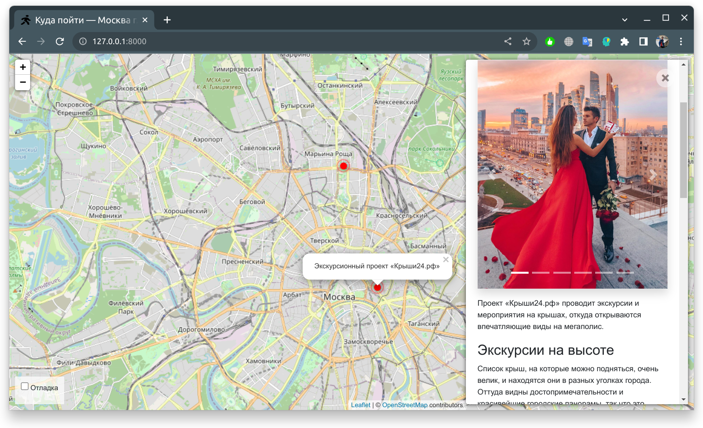

# Куда пойти — Москва глазами Артёма

Сайт о самых интересных местах в Москве. Авторский проект Артёма.



## Демо-версия сайта
Доступна по ссылке: [WhereToGo](https://egoista.pythonanywhere.com/)

Администрирование сайта: [Тут](https://egoista.pythonanywhere.com/admin/)

## Запуск

- Рекомендуется использовать виртуальное окружение для запуска проекта
- Для корректной работы Вам необходим Python версии 3.6 и выше
- Скачайте код
- Установите зависимости командой
```bash
pip install -r requirements.txt
```
- Создайте файл базы данных и сразу примените все миграции командой
```bash
python manage.py migrate
```
- Запустите сервер командой
```bash
python manage.py runserver
```

## Переменные окружения

Часть настроек проекта берётся из переменных окружения. Чтобы их определить, 
создайте файл `.env` рядом с `manage.py` и запишите туда данные в таком 
формате: `ПЕРЕМЕННАЯ=значение`.

Доступные переменные:
- `DEBUG` — режим отладки. Поставьте True, чтобы увидеть отладочную информацию в случае ошибки.
- `SECRET_KEY` — секретный ключ проекта
- `ALLOWED_HOSTS` — смотри [документацию Django](https://docs.djangoproject.com/en/3.1/ref/settings/#allowed-hosts).

## Цели проекта

Тестовые данные взяты с сайта [KudaGo](https://kudago.com).

Код написан в учебных целях — это урок в курсе по Python и веб-разработке на сайте [Devman](https://dvmn.org).
